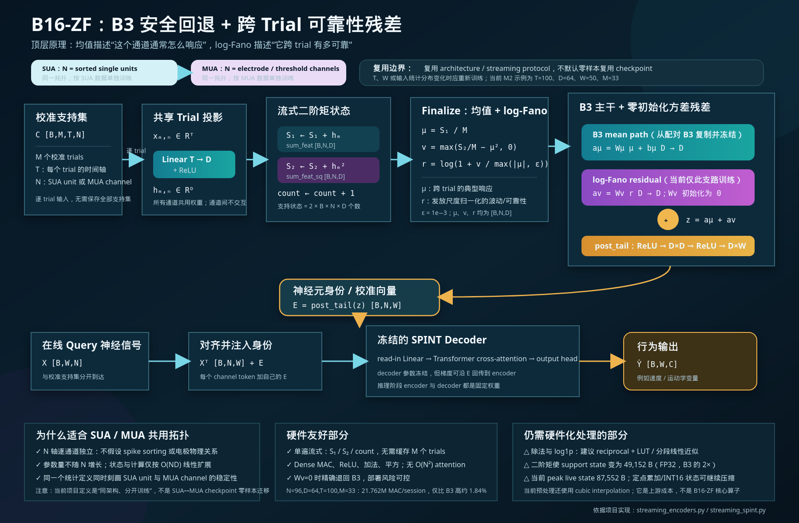

# B16-ZF 架构与硬件友好性说明



## 一句话结论

B16-ZF 是一个 **SUA/MUA 都能使用、面向流式部署、相对硬件友好** 的校准 encoder。它的主计算由 Dense MAC、ReLU、加法和平方组成，也不在神经元/通道轴上做 attention；但它不是“无需改造即可直接上芯片”的纯整数架构，因为 `finalize` 阶段仍包含除法和 `log1p`，二阶矩还会让支持集状态增加为 B3 的两倍。

这里的“SUA/MUA 都能使用”指 **复用网络拓扑、张量协议和流式累加方式**。当前项目并没有把它定义成 SUA checkpoint 到 MUA checkpoint 的零样本迁移方案。SUA 与 MUA 的输入统计不同，通常应该分别训练；`T` 或 `W` 改变时，权重形状也会改变，必须重训或重新适配。

## 顶层原理

B3 只根据校准 trials 的平均 latent response 为每个神经元生成身份向量。B16-ZF 在这个稳定的 B3 主干旁边增加一条跨 trial 的“可靠性”残差：

- 均值 `μ` 回答：这个 unit/channel 通常产生怎样的响应？
- 归一化波动 `r` 回答：这个响应在不同 trial 之间有多稳定？
- 两者融合后得到每个 unit/channel 的校准身份 `E`。
- `E` 加到在线 query 的对应 channel token 上，再交给冻结的 SPINT decoder 解码行为。

因此，B16-ZF 不是另起一个大型网络，而是：

> `B16-ZF = 配对 B3 主干 + 零初始化的 log-Fano 残差`

方差残差的投影矩阵初始化为零，所以在 warm start 时 B16-ZF 与配对 B3 **逐输入精确等价**；只有训练学到可靠的增益后，它才会偏离 B3。这是它最重要的稳定性设计。

## 网络结构

设：

- `B`：batch size
- `M`：校准 trial 数
- `T`：每个 trial 的时间长度
- `N`：SUA unit 数或 MUA channel 数
- `D`：encoder latent dimension
- `W`：decoder window size

输入校准支持集为 `C ∈ R^[B,M,T,N]`。第 `m` 个 trial 转成 `[B,N,T]` 后，对每个通道独立应用共享的时间投影：

```text
h_m = ReLU(W_pre x_m + b_pre),   h_m ∈ R^[B,N,D]
```

逐 trial 累加两个状态，而不保存全部 `M` 个 trials：

```text
S1 ← S1 + h_m
S2 ← S2 + h_m²
count ← count + 1
```

支持集结束后一次性 finalize：

```text
μ = S1 / M
v = max(S2 / M - μ², 0)
r = log(1 + v / max(|μ|, ε)),    ε = 1e-3
```

其中 `r` 是 latent 空间的 log-Fano 类统计：用平均发放尺度归一化跨 trial 方差，并用 `log1p` 压缩动态范围。

两条支路的融合为：

```text
aμ = Wμ μ + bμ                  # 从配对 B3 复制
av = Wv r                       # Wv 初始化为 0
z  = aμ + av
E  = post_tail(z) ∈ R^[B,N,W]
```

`post_tail` 的结构是：

```text
ReLU → Linear(D,D) → ReLU → Linear(D,W)
```

在线 query `X ∈ R^[B,W,N]` 转成 `[B,N,W]` 后，逐通道加入 `E`：

```text
src = Xᵀ + E
Y = FrozenSPINTDecoder(src),     Y ∈ R^[B,W,C]
```

训练 encoder 时，decoder 权重冻结但计算图仍允许梯度经 `E` 回传；部署推理时两者都是固定权重。

## 为什么同一拓扑适用于 SUA 和 MUA

| 结构性质 | 对 SUA/MUA 复用的意义 |
|---|---|
| `N` 轴逐通道独立 | 不要求输入一定经过 spike sorting，也不依赖电极间固定拓扑 |
| 所有通道共享 `T→D` 和 `D→W` 权重 | SUA unit 与 MUA channel 只被视作不同来源的 channel token |
| 参数量不随 `N` 增长 | 改变 unit/channel 数不会改变 encoder 参数形状 |
| `S1/S2` 状态按 `O(ND)` 扩展 | 通道数增加时资源线性增长，不出现 `O(N²)` 交互 |
| 均值 + 归一化波动 | 同一统计定义可以描述单神经元和多单元阈值通道的典型响应与可靠性 |

需要严格区分三种“复用”：

1. **架构复用：可以。** SUA/MUA 使用同一 B16-ZF 类和同一数据流。
2. **B3 到 B16-ZF warm start：可以。** 形状匹配时可精确映射 B3 权重。
3. **SUA 到 MUA checkpoint 零样本复用：不应默认。** 输入分布和通道语义改变，应分别训练验证。

## 硬件友好性评估

| 部分 | 评价 | 原因或实现建议 |
|---|---|---|
| 逐 trial 数据流 | 友好 | 单遍处理，不缓存整个支持集 |
| Linear / ReLU | 友好 | 标准 MAC array 与逐元素激活 |
| `S1`、`S2`、平方 | 友好但需位宽设计 | 使用宽累加器；需分析 `M`、量化范围与溢出 |
| 神经元/通道扩展 | 友好 | 无 channel-axis attention，资源线性增长 |
| 除法 | 需近似/共享 | `1/M` 可预计算；`1/max(|μ|,ε)` 可用 reciprocal LUT 或迭代近似 |
| `log1p` | 需近似 | 建议 LUT、分段线性或定点多项式 |
| 二阶矩存储 | 代价明确 | 相比 B3 多保存一份 `[B,N,D]` 的 `S2` |
| 上游 cubic interpolation | 需另行优化 | 属于当前输入预处理，不是 B16-ZF encoder 核心算子 |

所以更准确的表述是：

> B16-ZF 的 **拓扑和数据流硬件友好**；`log1p`、reciprocal 与二阶矩位宽需要专门做定点化和近似设计。

## 当前 M2 配置的具体规模

按 `N=96, D=64, T=100, W=50, M=33`、FP32 估算：

| 指标 | B16-ZF |
|---|---:|
| encoder 参数量 | 22,130 |
| 权重存储 | 88,520 B |
| 当前推荐训练的新增参数 `Wv` | 4,096 |
| 每个 trial 的主投影 MAC | 614,400 |
| 每个 session 的 encoder MAC | 21,762,048 |
| 相对配对 B3 的 session MAC 增幅 | 约 1.84% |
| `S1 + S2` 支持状态 | 49,152 B |
| 单 trial 输入 buffer | 38,400 B |
| peak live state | 87,552 B |

计算量相对 B3 只增加很少，主要新增代价不是 MAC，而是：

- 第二份累加状态 `S2`
- finalize 阶段的归一化除法
- `log1p` 近似

如果目标是 ASIC/FPGA，优先级建议是：先确定累加器位宽和饱和策略，再实现 reciprocal/LUT，最后用训练后量化或量化感知训练验证 B16-ZF 相对 B3 的增益是否仍保留。

## 当前实验证据应该怎样解读

当前 B16-ZF 的优势是稳定的小幅正增益和安全回退设计，而不是已经证明了大幅提升：现有配对结果中 3/3 cell 为正，平均增量约 `+0.00260`、最差约 `+0.00133`，尚未达到此前设定的 `+0.005` 强效果门槛。

因此，当前最稳妥的工程判断是：

- **架构可用性：成立。**
- **SUA/MUA 同拓扑：成立。**
- **硬件可落地性：成立，但需近似和定点化。**
- **MUA 上显著优于 B3：目前证据还不够强。**

## 实现依据

- `streaming_calibration_exp/src/models/components/streaming_encoders.py`
  - `B3PreservingHighOrderStatsEncoder`
  - `B3PreservingNormalizedHighOrderStatsEncoder`（B16-ZF）
- `streaming_calibration_exp/src/models/components/streaming_spint.py`
  - `StreamingSpintModel.decode_with_identity`

